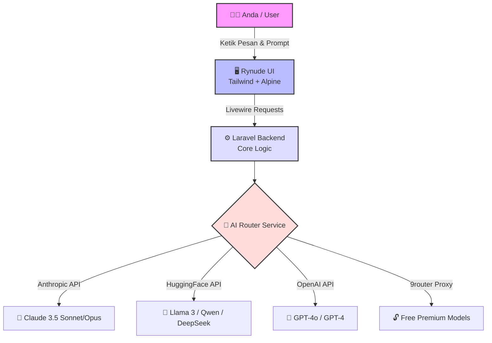

<div align="center">

# 🌟 Rynude AI

**The ultimate open-source UI clone for the agentic coding era.**

Rynude AI ships a pixel-perfect, lightning-fast chat interface — empowering you to chat with the world's most advanced AI models locally and for free.

[](https://npmjs.com/package/rynude)
[](https://npmjs.com/package/rynude)
[]()
[]()
[]()
[]()

<br />

[]()
[]()
[]()
[]()

<br />

*⭐ Help us reach more developers and grow the Rynude community. Star this repo! ⭐*

</div>

---

## 📖 Apa itu Rynude AI?

Rynude AI adalah antarmuka obrolan (Chat UI) *open-source* yang mereplika pengalaman premium dari Claude AI, namun memberikan Anda **kemerdekaan penuh** untuk mencolokkan ( *plug-in* ) berbagai mesin AI (LLM) dari seluruh dunia. 

Daripada harus membuka banyak *tab* browser untuk ChatGPT, Claude, dan Hugging Face secara terpisah, Rynude menyatukan semuanya dalam satu aplikasi lokal milik Anda sendiri yang super cepat, aman, dan tanpa batasan!

### 🏗️ Arsitektur Aplikasi (Cara Kerja)



### 🏆 Komparasi Dukungan Provider AI

| Provider Terdukung | Status Dukungan | Keunggulan Utama | Model Terbaik Saat Ini |
| :--- | :---: | :--- | :--- |
| **Hugging Face** | ✅ Native | Gratis, Ratusan Model Open-Source | `Llama-3.3-70B`, `DeepSeek-V4` |
| **Anthropic** | ✅ Native | Resmi, Paling Cerdas (Coding & Logika) | `Claude 3.5 Sonnet` |
| **OpenAI** | ✅ Native | Resmi, Ekosistem Terbesar | `GPT-4o` |
| **9router Proxy** | ✅ Native | Akses model premium gratis (Bypass) | `Rynude Sonnet / Haiku` |

---

## ✨ Fitur Unggulan
- 🎨 **UI Premium & Responsif**: Desain *pixel-perfect* mirip Claude AI (mendukung Desktop & Mobile).
- 🌗 **Dark/Light Mode**: Sinkronisasi otomatis dengan tema sistem atau atur manual sesuka hati.
- ⚡ **Real-time AI Chat**: *Streaming* teks super cepat via Server-Sent Events (SSE).
- 📦 **Artifacts Panel**: Panel cerdas untuk menampilkan baris kode, dokumen HTML, hingga *render* komponen UI.
- ⚙️ **Dynamic API Config**: Ganti API Key dan Custom Provider bebas hambatan langsung dari menu Settings.

---

## 🚀 Instalasi Super Cepat (One-Click Install)

Lupakan cara manual yang ribet! Sekarang Anda bisa menginstal keseluruhan project ini (termasuk otomatis mengatur *database*, dependensi, dan *global command*) hanya dengan **satu baris perintah**.

### 📋 Syarat (Pre-requisites)
Pastikan komputer Anda sudah memiliki:
- **PHP** (>= 8.2) & **Composer**
- **Node.js** & **NPM**
- **Git**

### 💻 Mulai Instalasi
Buka terminal/CMD Anda dari mana saja, lalu ketikkan perintah ajaib ini:

```bash
npx install-rynude
```

☕ *Duduk santai dan biarkan script otomatis kami bekerja. Sistem akan mengunduh source code ke dalam folder tersembunyi, menyiapkan segalanya, dan menyulap PC Anda!*

---

## 🎮 Cara Menjalankan Aplikasi

Kini menjalankan Rynude AI semudah menyalakan lampu! Anda tidak perlu lagi mencari di mana folder instalasinya berada.

Cukup buka terminal baru (dari Desktop, Documents, atau mana saja), dan ketik:
```bash
rynude
```
Sistem akan otomatis menyalakan *backend* dan *frontend*, lalu menyajikan aplikasinya ke browser Anda! 🚀

---

## 🔄 Cara Update Aplikasi

Jika ada fitur baru atau perbaikan *bug* dari kami, Anda cukup menjalankan perintah ini di terminal untuk memperbarui aplikasi Anda secara instan:

```bash
npx install-rynude@latest
```
*(Script akan mendeteksi instalasi lama Anda dan otomatis melakukan update ke versi source code terbaru).*

---

## 🤖 Cara Pakai Model AI Gratis (dengan 9router)

Rynude AI secara native mendukung API resmi (OpenAI, Anthropic, dll). Namun, jika Anda ingin menggunakan **model premium secara gratis** (via proxy 9router), ikuti trik kilat berikut:

### 1. Jalankan 9router
Buka **terminal baru** (biarkan aplikasi Rynude tetap jalan di terminal sebelumnya), lalu jalankan:
```bash
npx 9router
```
*(Ingat: Biarkan terminal 9router ini selalu terbuka selama Anda chatting).*

### 2. Hubungkan 9router ke Rynude
1. Buka Rynude di browser dan silakan **Login/Register** (akun lokal bebas).
2. Klik nama/ikon profil Anda di pojok bawah untuk membuka **Settings Modal**.
3. Pilih tab **API Keys**.
4. Gulir ke bagian **Proxy API Key / Proxy Settings**, lalu isi dengan:
   - **Base URL (Custom Endpoint):** `http://localhost:20128/v1`
   - **API Key:** `sk-dummy-key`
5. Klik **Simpan**.
6. Tutup menu pengaturan, lalu kembali ke layar obrolan (*chat*).
7. Pada *dropdown* pilihan model di atas layar, pilih **Rynude Sonnet** atau **Rynude Haiku**.

🎉 **Selesai!** Sekarang semua obrolan Anda akan direspons oleh kecerdasan model Claude secara gratis melalui 9router. Selamat menikmati!

---

## 🚀 Cara Pakai Ratusan Model Keren (dengan Hugging Face)

Anda juga bisa memanfaatkan server gratis **Hugging Face** yang menyimpan ribuan model open-source tercanggih di dunia (seperti Qwen, Llama 3, DeepSeek, Kimi, Gemma, dll).

### Cara Menghubungkan:
1. Buat akun gratis di [Hugging Face](https://huggingface.co).
2. Buat **Access Token (API Key)** di menu *Settings -> Access Tokens*.
3. Buka **Settings** di Rynude AI, lalu pergi ke tab **Hugging Face**.
4. Masukkan *API Key* Anda dan klik **Simpan**.
5. Tutup halaman *Settings*, lalu klik menu *dropdown* model di pojok kiri atas obrolan.
6. Voila! Model-model dengan **akhiran "HG"** (seperti `HG Qwen3.6`, `HG DeepSeek-V4-Pro`, `HG Llama-3.1-8B-Instruct`) yang sebelumnya berwarna abu-abu kini akan **aktif dan bisa dipilih**!

*(Sistem ini sepenuhnya otomatis, URL Router sudah diatur canggih di balik layar agar Anda tidak repot lagi!)*

---
