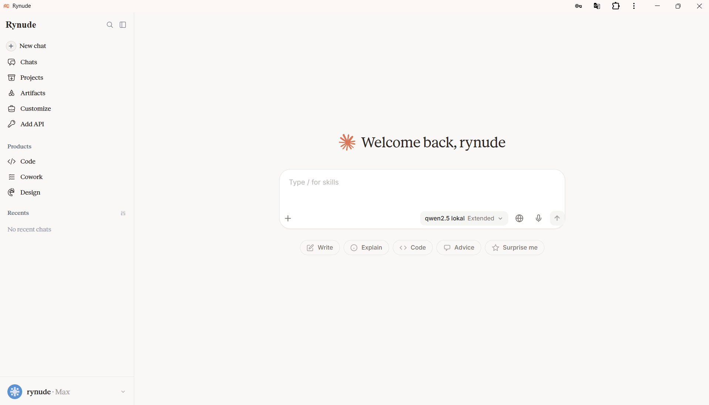
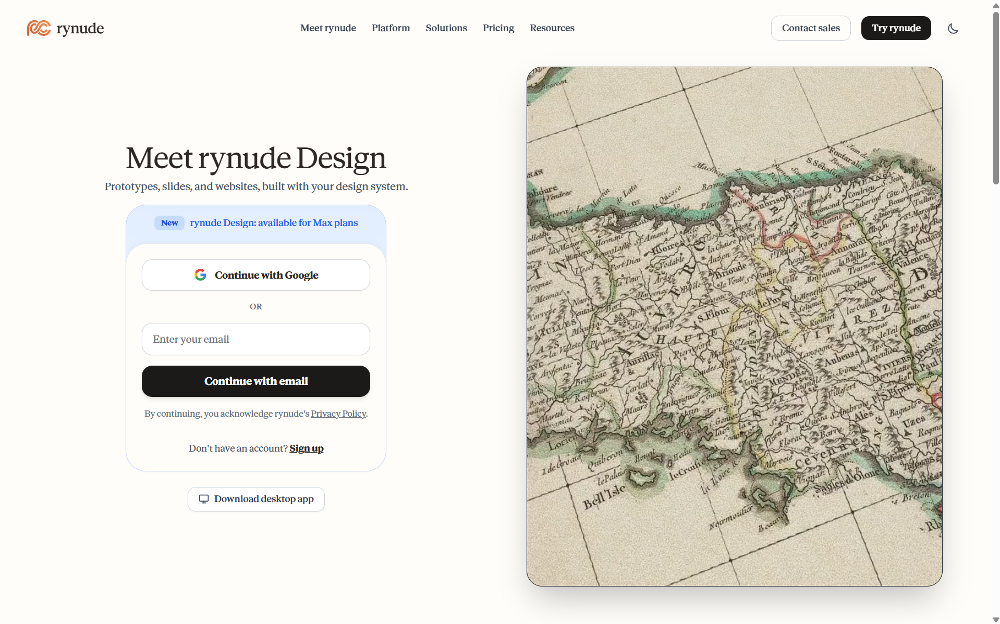
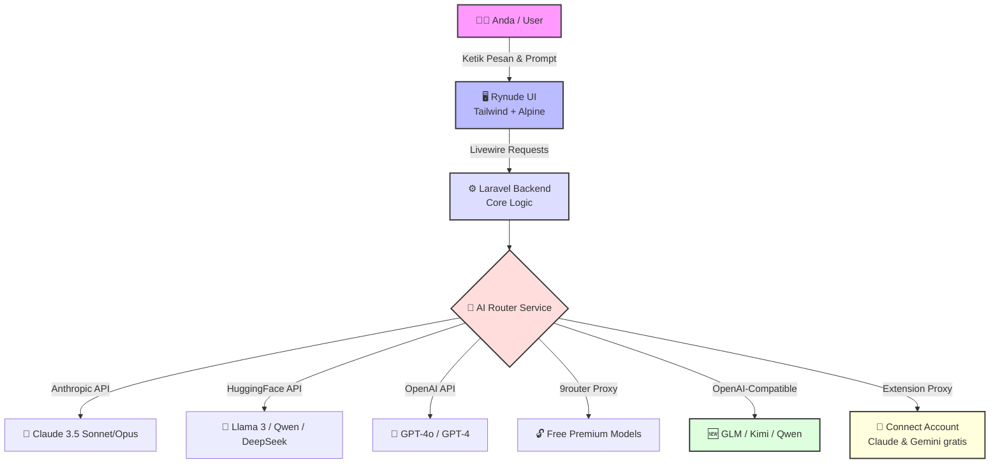
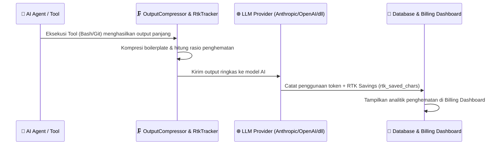
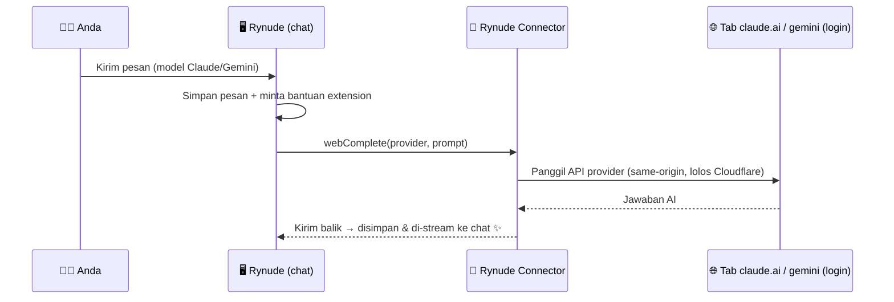

<div align="center">

#  Rynude AI

**The ultimate open-source UI clone for the agentic coding era.**

Rynude AI ships a pixel-perfect, lightning-fast chat interface — empowering you to chat with the world's most advanced AI models locally and for free.

[](https://npmjs.com/package/rynude)
[](https://npmjs.com/package/rynude)
[]()
[]()
[]()
[]()

<br />

[]()
[]()
[]()
[]()

<br />

*⭐ Help us reach more developers and grow the Rynude community. Star this repo! ⭐*

</div>

---

## 📖 Apa itu Rynude AI?

Rynude AI adalah antarmuka obrolan (Chat UI) *open-source* yang mereplika pengalaman premium dari Claude AI, namun memberikan Anda **kemerdekaan penuh** untuk mencolokkan ( *plug-in* ) berbagai mesin AI (LLM) dari seluruh dunia. 

Daripada harus membuka banyak *tab* browser untuk ChatGPT, Claude, dan Hugging Face secara terpisah, Rynude menyatukan semuanya dalam satu aplikasi lokal milik Anda sendiri yang super cepat, aman, dan tanpa batasan!

### 📸 Tampilan Aplikasi (Screenshots)

<div align="center">
  
  <br />
  
</div>

### 🏗️ Arsitektur Aplikasi (Cara Kerja)



### 🗜️ Alur Kerja RTK (Response Token Kuration)



### 🏆 Komparasi Dukungan Provider AI

| Provider Terdukung | Status Dukungan | Keunggulan Utama | Model Terbaik Saat Ini |
| :--- | :---: | :--- | :--- |
| **Hugging Face** | ✅ Native | Gratis, Ratusan Model Open-Source | `Llama-3.3-70B`, `DeepSeek-V4` |
| **Anthropic** | ✅ Native | Resmi, Paling Cerdas (Coding & Logika) | `Claude 3.5 Sonnet` |
| **OpenAI** | ✅ Native | Resmi, Ekosistem Terbesar | `GPT-4o` |
| **9router Proxy** | ✅ Native | Akses model premium gratis (Bypass) | `Rynude Sonnet / Haiku` |
| **GLM (Z.ai)** 🆕 | ✅ API Key | OpenAI-compatible, **ada model gratis** | `glm-4.5-flash`, `glm-4.7-flash` |
| **Kimi (Moonshot)** 🆕 | ✅ API Key | Konteks super panjang | `kimi-latest`, `moonshot-v1` |
| **Qwen (Alibaba)** 🆕 | ✅ API Key | Multibahasa & jago coding | `qwen-plus`, `qwen-max` |
| **Connect Account** 🆕 | ✅ Extension | Chat via **akun web gratis** (tanpa API key) | `Claude`, `Gemini` |

---

## ✨ Fitur Unggulan

<details>
<summary><b>🎨 UI Premium & Responsif</b></summary>
<br/>
Desain <i>pixel-perfect</i> yang 100% mirip dengan Claude AI. Dirancang khusus untuk memberikan pengalaman premium baik saat Anda membukanya di Desktop maupun Smartphone.
</details>

<details>
<summary><b>🌗 Dynamic Dark/Light Mode</b></summary>
<br/>
Sistem tema pintar yang tersinkronisasi otomatis dengan pengaturan sistem operasi Anda. Atau, atur manual sesuka hati untuk kenyamanan mata.
</details>

<details>
<summary><b>⚡ Real-time AI Chat (SSE Streaming)</b></summary>
<br/>
Rasakan kecepatan tanpa batas. Teks dari AI akan mengalir seketika secara <i>streaming</i> menggunakan teknologi Server-Sent Events (SSE), tanpa perlu menunggu <i>loading</i> panjang.
</details>

<details>
<summary><b>📦 Artifacts Panel Cerdas</b></summary>
<br/>
Bukan sekadar <i>chat</i> biasa. Rynude dilengkapi panel khusus untuk menampilkan <i>source code</i>, merender dokumen HTML, hingga memvisualisasikan komponen UI secara langsung layaknya IDE sungguhan.
</details>

<details>
<summary><b>⚙️ Dynamic API Configuration</b></summary>
<br/>
Kemerdekaan di tangan Anda. Ganti API Key, ubah <i>Base URL</i>, dan tambahkan <i>Custom Provider</i> secara instan langsung dari menu Settings tanpa menyentuh <i>source code</i>.
</details>

<details>
<summary><b>🔥 RTK (Response Token Kuration/Compression)</b></summary>
<br/>
Teknologi kompresi output canggih yang secara otomatis memotong boilerplate, log berlebih, dan redudansi pada respons tool/command sebelum dikirim ke LLM. Menghemat penggunaan token hingga 30-50% dan mempercepat waktu respons AI tanpa mengurangi keakuratan konteks! Dilengkapi dengan Dashboard Analytics per sesi/hari di menu Settings -> Billing.
</details>

<details>
<summary><b>🔌 Connect Account — Chat Gratis via Akun Web (Tanpa API Key)</b></summary>
<br/>
Punya akun <b>claude.ai</b> atau <b>Gemini</b> gratis? Sambungkan langsung ke Rynude lewat <b>Rynude Connector</b> (browser extension). Extension menjalankan panggilan dari dalam tab provider yang sudah login Anda, sehingga <b>menembus proteksi Cloudflare</b> yang biasanya memblokir server. Balasan lalu dialirkan mulus ke chat Rynude — tak perlu API key sama sekali. Lihat bagian <a href="#-connect-account--chat-gratis-pakai-akun-web-claude--gemini">Connect Account</a> di bawah.
</details>

<details>
<summary><b>🏷️ Judul Chat Otomatis dari Isi</b></summary>
<br/>
Setiap percakapan baru langsung diberi judul ringkas berdasarkan pesan pertama Anda — instan, tanpa menunggu <i>queue worker</i>, dan tak akan lagi menampilkan "New Chat" yang membingungkan.
</details>

<details>
<summary><b>🔢 Urutan Model yang Rapi & Bisa Diatur</b></summary>
<br/>
Daftar model di <i>picker</i> kini mengikuti urutan yang Anda tentukan di <code>AiModelSeeder</code> (kolom <code>sort_order</code>) — tidak acak. Model custom otomatis turun ke paling bawah agar rapi.
</details>

---

## 🚀 Instalasi "One-Click" Super Cepat

Lupakan cara instalasi manual yang menyiksa! Kami telah merancang *Auto-Installer* tercanggih. Seluruh *setup* database, dependensi, dan perintah global akan ditangani oleh sistem secara otomatis.

### 📋 Prasyarat Sistem
Sistem kami kini dilengkapi **Smart Dependency Detection**. Pastikan Anda menginstal komponen berikut, atau biarkan *installer* cerdas kami yang memberitahu Anda apa yang kurang:
- **PHP** (>= 8.2) & **Composer**
- **Node.js** (>= 18) & **NPM**
- **Git**

> [!TIP]
> **Pengguna macOS:** macOS modern tidak lagi menyertakan PHP bawaan. Semua prasyarat bisa dipasang sekali jalan lewat [Homebrew](https://brew.sh):
> ```bash
> brew install php composer node git
> ```

### 💻 Mulai Instalasi
Buka terminal/CMD di mana saja, lalu ketikkan mantra ajaib ini:

```bash
npx install-rynude
```

> [!TIP]
> ☕ **Duduk dan nikmati kopi Anda.** Sistem akan otomatis mengunduh *source code* ke folder tersembunyi yang aman, menyiapkan seluruh konfigurasi, dan menyulap PC Anda menjadi mesin AI dalam hitungan detik!

---

## 🎮 Menjalankan Aplikasi

Menjalankan Rynude AI semudah menyalakan saklar lampu. Anda tidak perlu lagi repot-repot mencari letak direktori proyek. 

Buka terminal **baru** dari mana saja (Desktop, Documents, dll), lalu ketik:

```bash
rynude
```

> [!NOTE]
> Sistem akan otomatis menghidupkan *backend* (Laravel) dan *frontend* (Vite), lalu seketika menyajikan antarmuka aplikasi super mulus ke *browser* favorit Anda! 🚀

> [!IMPORTANT]
> **Queue worker.** Judul chat dibuat otomatis di *background* (asinkron) agar balasan AI tidak tertunda. Perintah `rynude` **sudah otomatis menyalakan queue worker** untuk Anda (dan mematikannya saat keluar), jadi Anda tidak perlu menjalankan apa pun secara manual. Skrip `composer dev` juga sudah menyertakan `queue:listen`. Hanya jika Anda menjalankan `php artisan serve` sendiri tanpa keduanya, barulah jalankan worker terpisah:
> ```bash
> php artisan queue:work
> ```

### 🆕 Fitur Terbaru

| Fitur | Cara Pakai |
| :--- | :--- |
| 🧩 **Skills aktif** | Skill yang Anda aktifkan di panel *Customize* kini benar-benar memengaruhi jawaban AI (disisipkan ke *system prompt*). |
| 🔗 **Share chat** | Menu titik-tiga pada sebuah chat → **Share**. Tautan publik *read-only* otomatis tersalin ke clipboard. |
| 🌐 **Web search** | Tombol **+** pada kotak input → **Web search**. AI akan mengutip hasil pencarian terkini (keyless DuckDuckGo, atau set `SEARCH_API_KEY`). |
| 🎤 **Dikte suara & baca lantang** | Ikon mikrofon untuk dikte; ikon speaker pada balasan untuk membacakannya (Web Speech API). |
| 🎨 **Artifact: versi & publish** | Berpindah antar-versi artifact, lalu **Publish** untuk membuat tautan publik. |
| 🔌 **Connect Account** 🆕 | Tab **Connect Account** di *Add API* → aktifkan **Claude/Gemini** lewat *Rynude Connector* extension, chat gratis tanpa API key. |
| 🆓 **Provider baru: GLM / Kimi / Qwen** 🆕 | Tab **API Keys** di *Add API* → isi API key **GLM (Z.ai, ada model gratis)**, **Kimi**, atau **Qwen**. Endpoint sudah otomatis. |
| 🏷️ **Judul chat otomatis** 🆕 | Chat baru langsung berjudul sesuai isi pesan pertama — bukan lagi "New Chat". |
| 🔢 **Urutan model rapi** 🆕 | Daftar model mengikuti urutan `sort_order` di seeder — tidak acak lagi. |

---

## 🔄 Pembaruan (Update) Instan

Dapatkan fitur terbaru dan perbaikan *bug* tanpa pusing. Jalankan perintah ini untuk memperbarui aplikasi Anda secara instan:

```bash
npx install-rynude@latest
```

> [!IMPORTANT]
> *Script akan cerdas mendeteksi instalasi lama Anda, melakukan **backup otomatis** pada database & konfigurasi, lalu melakukan update mulus ke versi terbaru tanpa menghilangkan sedikit pun data Anda.*

### 🛡️ Database Anda Aman Saat Update

Update mengganti **kode** di folder project. Agar data Anda tidak ikut ter-reset, perintah `rynude` kini **otomatis menyimpan database di luar folder project** — di folder home Anda:

```
~/.rynude/database.sqlite      ← database asli (tidak pernah disentuh update)
~/.rynude/backups/             ← 15 backup ber-timestamp terbaru
```

Setiap kali Anda menjalankan `rynude`, sistem akan:
1. Memindahkan database ke `~/.rynude/` (sekali, pada run pertama) dan mengarahkan `.env` ke sana.
2. Membuat **backup ber-timestamp** baru.
3. Menjalankan `php artisan migrate` (additif — hanya menambah tabel/kolom baru, tidak menghapus data).

Jadi walau folder project ditimpa update, data Anda tetap utuh. Untuk memulihkan manual, cukup salin salah satu file dari `~/.rynude/backups/` menjadi `~/.rynude/database.sqlite`.

---

## 🤖 Menikmati Model AI Premium (Gratis via 9router)

Rynude AI mendukung API resmi secara *native* (OpenAI, Anthropic, dll). Namun, jika Anda ingin merasakan kecerdasan model premium secara **gratis** (via proxy lokal `9router`), ikuti trik kilat ini:

### 1. Nyalakan Mesin Proxy
Buka **terminal baru** (biarkan aplikasi Rynude tetap hidup di terminal sebelumnya), lalu jalankan:
```bash
npx 9router
```
*(⚠️ Biarkan terminal 9router ini selalu terbuka selama Anda melakukan chatting).*

### 2. Hubungkan Proxy ke Rynude
1. Buka Rynude di browser dan **Login/Register** (bebas buat akun lokal apapun).
2. Buka menu **Settings** (klik ikon profil di pojok kiri bawah).
3. Pilih tab **API Keys**.
4. Gulir ke bagian **Proxy API Key**, dan isikan data sakti berikut:
   - **Base URL:** `http://localhost:20128/v1`
   - **API Key:** `sk-dummy-key`
5. Klik **Simpan** dan tutup *Settings*.
6. Pada *dropdown* pilihan model di atas chat, pilih **Rynude Sonnet** atau **Rynude Haiku**.

> [!TIP]
> 🎉 **BOOM!** Semua obrolan Anda sekarang ditenagai oleh kecerdasan kelas atas secara gratis. Selamat berkreasi!

---

## 🌌 Eksplorasi Ratusan Model Keren (Hugging Face)

Bosan dengan model standar? Mari manfaatkan server gratis **Hugging Face** yang menyimpan ribuan mesin AI *open-source* tercanggih di dunia (Qwen, Llama 3, DeepSeek, Kimi, Gemma, dll).

### Panduan Menghubungkan:
1. Daftarkan akun gratis di [Hugging Face](https://huggingface.co).
2. Buat **Access Token** di menu *Settings -> Access Tokens*.
3. Buka **Settings** di Rynude AI, lalu navigasi ke tab **Hugging Face**.
4. Masukkan *Token* rahasia Anda dan klik **Simpan**.
5. Tutup *Settings*, lalu buka *dropdown* model di pojok kiri atas obrolan Anda.

> [!TIP]
> ✨ **Voila!** Puluhan model tangguh berakhiran **"HG"** (seperti `HG Qwen3.6`, `HG DeepSeek-V4-Pro`) yang sebelumnya berwarna abu-abu terkunci, kini otomatis **menyala dan siap dieksekusi**!

*(Seluruh routing URL ke server Hugging Face sudah diatur sangat canggih di balik layar agar Anda tinggal pakai tanpa repot coding!)*

---

## 🔌 Connect Account — Chat Gratis pakai Akun Web (Claude & Gemini)

Punya akun **claude.ai** atau **Gemini** gratis? Anda bisa memakainya langsung di Rynude **tanpa API key sama sekali** — lewat browser extension **Rynude Connector**.

### 🧠 Kenapa harus lewat extension?

Situs seperti claude.ai dilindungi **Cloudflare** yang memblokir semua permintaan dari server. Trik Rynude: extension menjalankan panggilan **dari dalam tab provider yang sudah login Anda** (same-origin), sehingga membawa cookie & sidik jari browser asli dan **lolos Cloudflare** — sesuatu yang mustahil dilakukan server.



### 🚀 Cara Pakai

1. **Pasang extension:** buka **Add API → Connect Account → Download Extension**, ekstrak, lalu *Load unpacked* di `chrome://extensions` (aktifkan Developer mode).
2. **Login** di [claude.ai](https://claude.ai) dan/atau [gemini.google.com](https://gemini.google.com) (biarkan satu tab terbuka, boleh di-*pin*).
3. Di Rynude → **Add API → Connect Account** → klik **Connect Claude** / **Connect Gemini**.
4. Di tab **API Keys**, **kosongkan** Anthropic/Google API key & pastikan proxy **OFF** (agar jalur akun-web yang dipakai).
5. Buka chat, pilih model **Claude** atau **Gemini** → kirim. Jawaban muncul lewat akun gratis Anda! 🎉

> [!NOTE]
> **Keandalan per provider:** **Claude** ✅ andal · **Gemini** ✅ jalan (format webnya bisa berubah sewaktu-waktu) · **ChatGPT** 🔴 tidak didukung — OpenAI mewajibkan *proof-of-work + Turnstile* yang tak bisa ditembus. Untuk GPT, gunakan API key resmi.

> [!WARNING]
> Fitur ini memakai API web yang direverse-engineer dan **berpotensi melanggar ToS provider** (risiko akun dibatasi). Gunakan dengan bijak untuk keperluan pribadi.

---

## 🆓 Provider Baru: GLM, Kimi & Qwen (OpenAI-Compatible)

Tiga provider populer kini bisa dicolokkan langsung via **API Key** — endpoint-nya sudah otomatis, Anda tinggal isi *key*.

| Provider | Endpoint (otomatis) | Model contoh | Catatan |
| :--- | :--- | :--- | :---: |
| **GLM (Z.ai)** | `https://api.z.ai/api/paas/v4` | `glm-4.5-flash`, `glm-4.7-flash`, `glm-4.6` | 🆓 **Ada model gratis** |
| **Kimi (Moonshot)** | `https://api.moonshot.ai/v1` | `kimi-latest`, `moonshot-v1-8k` | 💳 Berbayar |
| **Qwen (Alibaba)** | `https://dashscope-intl.aliyuncs.com/compatible-mode/v1` | `qwen-plus`, `qwen-flash`, `qwen-max` | 💳 Berbayar |

### 🚀 Cara Pakai

1. Ambil API key: [Z.ai](https://z.ai/manage-apikey/apikey-list) · [Moonshot](https://platform.moonshot.ai/console/api-keys) · [Alibaba Bailian](https://bailian.console.alibabacloud.com/?tab=model#/api-key).
2. Buka **Add API → API Keys**, temukan kartu **GLM (Z.ai)** / **Kimi (Moonshot)** / **Qwen (Alibaba)**, tempel *key*, lalu **Save All API Keys**.
3. Di chat, pilih model-nya (mis. `GLM 4.5 Flash (Free)`) — langsung jalan!

> [!TIP]
> 💚 **Rekomendasi hemat:** pakai **GLM** — model `glm-4.5-flash` & `glm-4.7-flash` **gratis** dan cukup pintar. Kalau kode model ditolak ("model not found"), sesuaikan lewat **Add Model** (provider sudah tersedia opsi GLM/Kimi/Qwen).

---

## 🦙 Menjalankan Model Lokal 100% Bebas Kuota (Ollama)

Jika Anda ingin Rynude berjalan **sepenuhnya offline** dan **tanpa limit** di komputer Anda, Anda bisa menyambungkannya dengan Ollama. Anda bisa menggunakan model apa pun (seperti Llama 3.1, Qwen, Mistral, dll) secara gratis!

### 1. Instalasi Ollama & Download Model
1. Buka Terminal atau PowerShell Anda, lalu jalankan perintah resmi berikut sesuai Sistem Operasi Anda:
   
   **Untuk Windows (PowerShell):**
   ```bash
   irm https://ollama.com/install.ps1 | iex
   ```
   **Untuk macOS / Linux (Terminal):**
   ```bash
   curl -fsSL https://ollama.com/install.sh | sh
   ```

### 2. Rekomendasi 4 Model Terbaik & Perintah Downloadnya
Di terminal Anda, cukup *copy-paste* salah satu perintah di bawah ini untuk mendownload model "otak" AI ke komputer Anda (ukurannya berkisar antara 4GB - 8GB per model):

1. **Qwen 3.6** (Sangat cerdas, rajanya Coding & Logika buatan Alibaba)
   ```bash
   ollama run qwen3.6
   ```
2. **Gemma 4** (Andalan Google, luar biasa untuk penulisan & rangkuman)
   ```bash
   ollama run gemma4
   ```
3. **Qwen 2.5** (Sangat ringan, ngebut, dan luwes berbahasa Indonesia)
   ```bash
   ollama run qwen2.5
   ```
4. **Llama 3.1** (Jagoan open-source buatan Meta/Facebook, serba bisa)
   ```bash
   ollama run llama3.1
   ```

### 3. Mendaftarkan Model ke Aplikasi Rynude
Agar model-model yang sudah Anda download di atas muncul di Rynude, Anda hanya perlu mendaftarkannya di menu Settings. Kode cerdas Rynude AI sudah mendukung otomatisasi *routing* Ollama tanpa perlu setting API Key atau Base URL manual!

1. Buka aplikasi Rynude Anda dan masuk ke menu **Settings**.
2. Masuk ke tab **AI Models** lalu klik **Add Model**.
3. Isi datanya seperti ini (contoh jika Anda mendownload Qwen 3.6):
   - **Model Code**: `qwen3.6` *(HURUF KECIL SEMUA: harus sama persis dengan nama perintah `ollama run ...` di atas)*
   - **Model Name**: `Qwen 3.6 (Lokal)` *(Bebas, ini nama tampilan yang akan muncul di moremodel)*
   - **Provider**: **WAJIB** diisi `Ollama (Local)`.
4. Klik **Simpan**.

Selesai! Model tersebut akan langsung aktif, bisa Anda pilih di *dropdown* utama *chat*, dan langsung bekerja tanpa batas. Anda bisa mengulangi **Langkah 3** ini untuk memasukkan keempat model di atas ke dalam aplikasi Anda secara bersamaan!

### 4. Rekomendasi Spesifikasi Komputer (PC/Laptop)
Menjalankan *Rynude* bersamaan dengan "Otak Raksasa" *Ollama* di komputer yang sama tentu membutuhkan tenaga ekstra. Agar pengalaman *chatting* Anda mulus dan *ngebut*, berikut adalah spesifikasi yang disarankan:

*   **Minimum (Bisa Jalan tapi Agak Lambat):**
    *   **RAM:** 8 GB
    *   **Prosesor (CPU):** Intel Core i3 / i5 (Gen 8 ke atas) atau AMD Ryzen 3.
    *   **Penyimpanan:** Wajib SSD (Jangan pakai Hardisk biasa / HDD).
*   **Rekomendasi Nyaman (Sangat Ngebut & Mulus):**
    *   **RAM:** 16 GB atau lebih.
    *   **VGA / GPU (Penting):** NVIDIA RTX 3050, GTX 1660, atau kartu grafis dengan minimal **4GB VRAM**. *(Jika Anda punya GPU NVIDIA, Ollama akan otomatis menggunakannya dan kecepatan membalas chat bisa 10x lipat lebih cepat dibanding hanya menggunakan CPU!)*
    *   **Penyimpanan:** NVMe SSD.

---

## 💎 Fitur Utama & Sekilas Biaya (Key Features & Pricing)

Mengapa Anda harus beralih ke Rynude AI? Tabel di bawah ini menunjukkan perbandingan masif antara menggunakan layanan langganan AI konvensional dibandingkan memiliki server Rynude lokal Anda sendiri.

| Fitur / Komponen | Langganan Resmi (ChatGPT/Claude Pro) |  Rynude AI (Self-Hosted) |
| :--- | :--- | :--- |
| 💵 **Biaya Antarmuka (UI)** | $20 / bulan (~Rp 320.000) | **GRATIS 100% (Open-Source)** |
| 🧠 **Mesin AI Utama** | Terkunci pada 1 perusahaan | **Multi-Provider** (API Bebas Pilih) |
| 🎁 **Akses Model Premium** | Berbayar Penuh | **Bisa Gratis** (via Proxy / HF) |
| 🚦 **Batas Pesan (Limit)** | Ketat (Maks 40 pesan / 3 jam) | **Tanpa Batas** (Pay-as-you-go) |
| 🛡️ **Privasi & Keamanan** | Disimpan di Cloud Perusahaan | **Data 100% di Komputer Anda** |
| 🎨 **Personalisasi Tema** | Sangat Terbatas | **Bebas Kustomisasi** (Tailwind CSS) |
| 📦 **Fitur Artifacts (Code Render)**| Hanya di Anthropic Claude | **Tersedia Penuh** di Rynude |
| 🗜️ **Kompresi Token (RTK)** | Tidak ada (bayar penuh output boros) | **Aktif Otomatis** (Hemat Token hingga 50%) |

---

## 🧪 Menjalankan Test

```bash
php artisan test
```

> [!TIP]
> Jika test rute publik (`/share`, `/artifact`) gagal dengan *Route not defined*, bersihkan cache lebih dulu: `php artisan optimize:clear` (startup menjalankan `php artisan optimize` yang men-*cache* rute).

---

## 🚢 Catatan Produksi (saat deploy ke VPS / Cloud)

Aplikasi ini dioptimalkan untuk pemakaian lokal. Saat memindahkannya ke server publik, lakukan *hardening* berikut:

- Set `APP_ENV=production` dan `APP_DEBUG=false` di `.env`.
- Jalankan `php artisan config:cache route:cache view:cache` untuk performa.
- Pastikan **queue worker** berjalan sebagai *daemon* (mis. via `supervisor`) untuk pembuatan judul chat.
- Ganti `MAIL_MAILER=log` dengan *driver* email sungguhan agar verifikasi email berfungsi.
- Streaming AI berjalan di dalam *request* PHP; di belakang Nginx naikkan `fastcgi_read_timeout` agar respons panjang tidak terputus.
- Pertimbangkan *rate limiting* pada endpoint chat untuk mencegah penyalahgunaan.